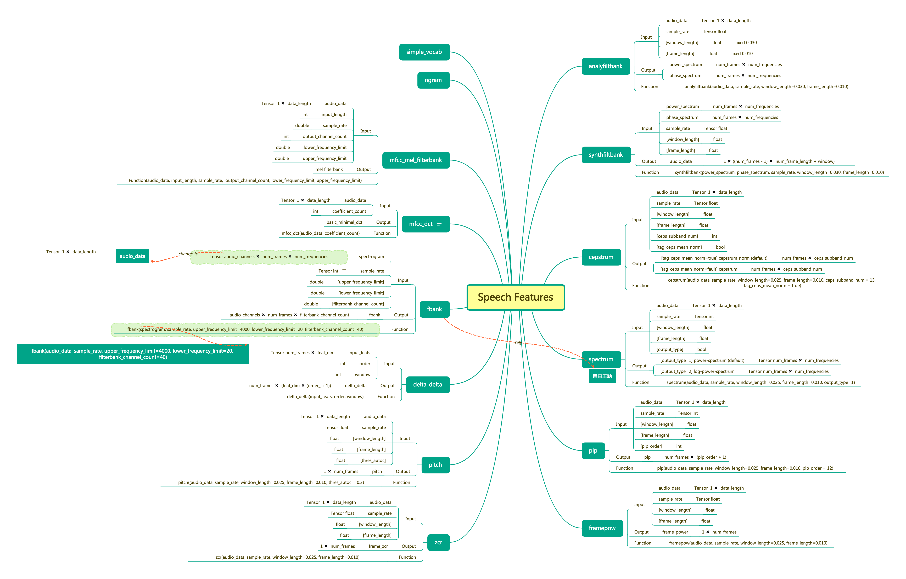
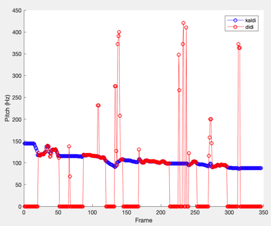
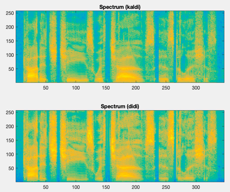
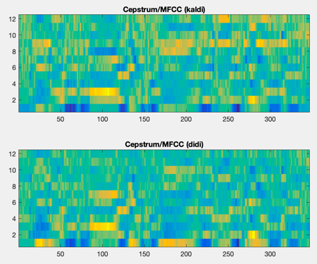
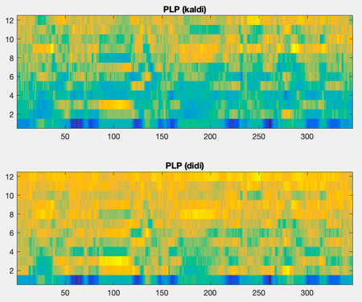

# Speech Features
## Goal
Add custom speech feature extraction ops, and compare the extracted features with kaldi's.

## Procedure
1. Create custom C++ op, **'xxx.h'** and **'xxx.cc'**
  
   Files should be stored in **delta/layers/ops/kernels/**, details can refer to existing files, e.g., pitch.cc / pitch.h

2. Implement the kernel for the op, **'xxx_op.cc'**
   
   Files should be stored in **delta/layers/ops/kernels/**, details can be found in [Tensorflow Guild: Adding a New Op](https://www.tensorflow.org/guide/extend/op)
   
3. Define the op's interface, **'x_ops.cc'**

   Files should be stored in **delta/layers/ops/kernels/**, details in above link
   
4. Compile by using **'delta/layers/ops/Makefile'**

5. Register op in **'delta/layers/ops/py_x_ops.py'**

6. Unit-test **'xxx\_op\_test.py'**

## Code Style
**C++** code: using **clang-format** and **cpplint** for formatting and checking

**Python** code: using **yapf** and **pylint** for formatting and checking

Please follow [Contributing Guide](https://git.xiaojukeji.com/speech-nlu/nlu-ml/blob/dev/docs/development/contributing.md)

## Existing Ops
* Pitch
* Frame power
* Zero-cross rate
* Power spectrum (PS) / log PS
* Cepstrum / MFCC
* Perceptual Linear Prediction (PLP)
* Analysis filter bank (AFB)  
  	*Currently support window\_length = 30ms and frame\_length = 10ms for perfect reconstruction.*
* Synthesis filter bank (SFB)

The specific interfaces of feature functions are shown below：

## Comparsion with KALDI
Extracted features are compared to existing KALDI features.

1. Pitch

	

2. Log power spectrum

	

3. Cepstrum / MFCC

	

4. PLP

    

 
## Reference

* [An Intuitive Discrete Fourier Transform Tutorial](http://practicalcryptography.com/miscellaneous/machine-learning/intuitive-guide-discrete-fourier-transform/)
* [Mel Frequency Cepstral Coefficient (MFCC) tutorial](http://practicalcryptography.com/miscellaneous/machine-learning/guide-mel-frequency-cepstral-coefficients-mfccs/)
* [A Tutorial on Cepstrum and LPCCs](http://practicalcryptography.com/miscellaneous/machine-learning/tutorial-cepstrum-and-lpccs/)
* [Speech Processing for Machine Learning: Filter banks, Mel-Frequency Cepstral Coefficients (MFCCs) and What's In-Between](https://haythamfayek.com/2016/04/21/speech-processing-for-machine-learning.html)

